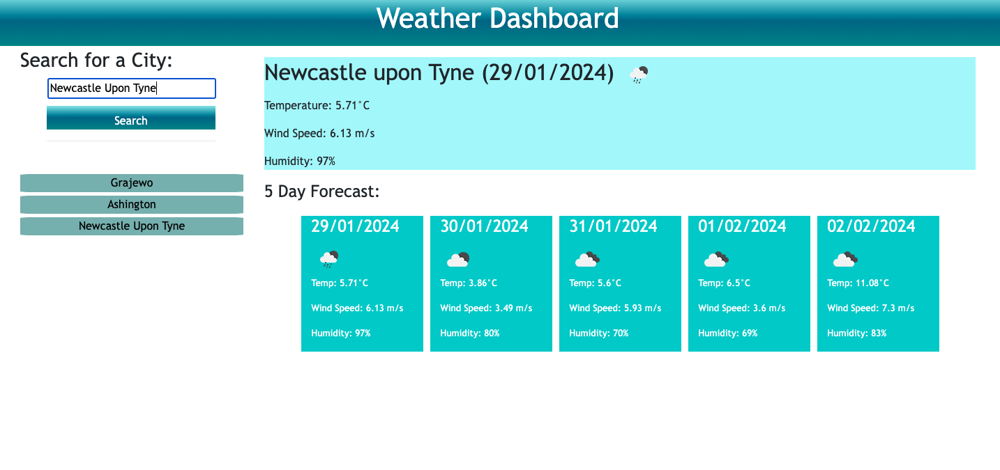

# Weather Forecast App

The Weather Forecast App is a web-based application that allows users to check the weather outlook for multiple cities, helping them plan their trips accordingly. This app utilizes the OpenWeatherMap API to retrieve weather data for cities and provides both current and future weather conditions.
Check out my [GitHub Pages](https://kamilawroblewska.github.io/My-weather-dashboard/)
## Features

- Search for a city and view its current and future weather conditions.  
- Display the city name, date, weather icon, temperature, humidity, and wind speed for the current weather.  
- Present a 5-day forecast with date, weather icon, temperature, and humidity.  
- Click on a previously searched city in the history to view its weather conditions again.  
- Persistent storage using Local Storage to save searched cities.

## Technologies Used

- HTML/CSS
- JavaScript
- jQuery
- OpenWeatherMap API

## How to Use

  

Open the index.html file in your web browser to launch the Weather Forecast App.
Enter a city name in the search input and click the "Search" button to retrieve weather data.
The current weather and 5-day forecast will be displayed on the screen.
Click on previously searched cities in the history to view their weather conditions again.
The app will store your search history in Local Storage for future reference.

## License

This project is licensed under the MIT License.

## Acknowledgments

edX for starter package
OpenWeatherMap for providing the weather data API.
jQuery for simplifying DOM manipulation.
Bootstrap for styling elements.
